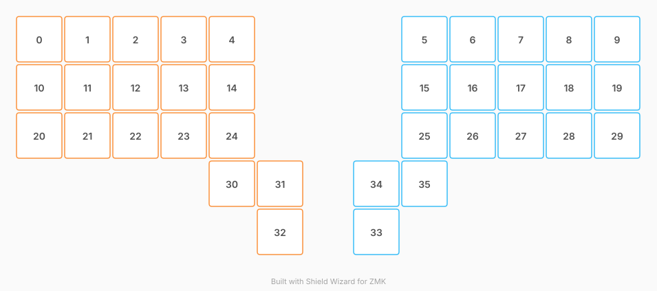

# ZMK Configuration for Ergo Tastatur

*Generated by Shield Wizard for ZMK*



Download compiled firmware from the Actions tab. <https://zmk.dev/docs/user-setup#installing-the-firmware>

Edit your keymap <https://zmk.dev/docs/keymaps>.
User keymap is located at [`config/ergo_tastatur.keymap`](config/ergo_tastatur.keymap).

-----

<details>
<summary>
Shield Wizard Debug Information
</summary>

In case of broken configuration, here is the Shield Wizard internal data used to generate this configuration:

Commit: ab99418c376887d043556e4a1af5a8d1c78d686c

```json
{"name":"Ergo Tastatur","shield":"ergo_tastatur","dongle":false,"modules":[],"layout":[{"id":"01M14JB5CTTEWCP0SBZXGXPR9P","part":0,"row":0,"col":0,"w":1,"h":1,"x":0,"y":-2,"r":0,"rx":0,"ry":0},{"id":"01M14JB5W23Z3A5F212AHVAY0J","part":0,"row":0,"col":1,"w":1,"h":1,"x":1,"y":-2,"r":0,"rx":0,"ry":0},{"id":"01M14JB6BAP6MB1ARZ8KGHGN6R","part":0,"row":0,"col":2,"w":1,"h":1,"x":2,"y":-2,"r":0,"rx":0,"ry":0},{"id":"01M14JB6VJ4G0GVEX708XQ3991","part":0,"row":0,"col":3,"w":1,"h":1,"x":3,"y":-2,"r":0,"rx":0,"ry":0},{"id":"01M14JB7CJAT4CNQGNSKWM70SQ","part":0,"row":0,"col":4,"w":1,"h":1,"x":4,"y":-2,"r":0,"rx":0,"ry":0},{"id":"01M14JDHM0YXEY2YXFTGYKPSR4","part":1,"row":0,"col":5,"w":1,"h":1,"x":8,"y":-2,"r":0,"rx":0,"ry":0},{"id":"01M14JDHKZ03VWASGCW84SM0ET","part":1,"row":0,"col":6,"w":1,"h":1,"x":9,"y":-2,"r":0,"rx":0,"ry":0},{"id":"01M14JDHKY684A8XPQT0N979G7","part":1,"row":0,"col":7,"w":1,"h":1,"x":10,"y":-2,"r":0,"rx":0,"ry":0},{"id":"01M14JDHKW6K48R1V2JC1ADB11","part":1,"row":0,"col":8,"w":1,"h":1,"x":11,"y":-2,"r":0,"rx":0,"ry":0},{"id":"01M14JDHKVN5GYZE46GD8W9KMP","part":1,"row":0,"col":9,"w":1,"h":1,"x":12,"y":-2,"r":0,"rx":0,"ry":0},{"id":"01M14JB572K5V8NMJB0VQ92FTD","part":0,"row":1,"col":0,"w":1,"h":1,"x":0,"y":-1,"r":0,"rx":0,"ry":0},{"id":"01M14JB5PTVS4S62NQ13KTV7WW","part":0,"row":1,"col":1,"w":1,"h":1,"x":1,"y":-1,"r":0,"rx":0,"ry":0},{"id":"01M14JB6629AD90R9Z8EC7701K","part":0,"row":1,"col":2,"w":1,"h":1,"x":2,"y":-1,"r":0,"rx":0,"ry":0},{"id":"01M14JB6PAB7AF922T0R0PYAR3","part":0,"row":1,"col":3,"w":1,"h":1,"x":3,"y":-1,"r":0,"rx":0,"ry":0},{"id":"01M14JB76SPMGB1AGJ5NKQZEF0","part":0,"row":1,"col":4,"w":1,"h":1,"x":4,"y":-1,"r":0,"rx":0,"ry":0},{"id":"01M14JDHM0NEQGYBNYEP4VRDKR","part":1,"row":1,"col":5,"w":1,"h":1,"x":8,"y":-1,"r":0,"rx":0,"ry":0},{"id":"01M14JDHKYE972T8B59TFHPP02","part":1,"row":1,"col":6,"w":1,"h":1,"x":9,"y":-1,"r":0,"rx":0,"ry":0},{"id":"01M14JDHKXN5T65TJYGZX5Q491","part":1,"row":1,"col":7,"w":1,"h":1,"x":10,"y":-1,"r":0,"rx":0,"ry":0},{"id":"01M14JDHKWJ800ECXAEF2WY6MR","part":1,"row":1,"col":8,"w":1,"h":1,"x":11,"y":-1,"r":0,"rx":0,"ry":0},{"id":"01M14JDHKVYW03QPW80KVMWEWB","part":1,"row":1,"col":9,"w":1,"h":1,"x":12,"y":-1,"r":0,"rx":0,"ry":0},{"id":"01M14JB4TAJF8FYTW7393D645N","part":0,"row":2,"col":0,"w":1,"h":1,"x":0,"y":0,"r":0,"rx":0,"ry":0},{"id":"01M14JB5J2V6ZFK5YES9VM68GX","part":0,"row":2,"col":1,"w":1,"h":1,"x":1,"y":0,"r":0,"rx":0,"ry":0},{"id":"01M14JB60TBSBWX8ZB6G4GY06B","part":0,"row":2,"col":2,"w":1,"h":1,"x":2,"y":0,"r":0,"rx":0,"ry":0},{"id":"01M14JB6GJ3D41ZWBMYKTRDV05","part":0,"row":2,"col":3,"w":1,"h":1,"x":3,"y":0,"r":0,"rx":0,"ry":0},{"id":"01M14JB71APJGC31FNFWFTMTB7","part":0,"row":2,"col":4,"w":1,"h":1,"x":4,"y":0,"r":0,"rx":0,"ry":0},{"id":"01M14JDHKZR3HTEGK6FV71K784","part":1,"row":2,"col":5,"w":1,"h":1,"x":8,"y":0,"r":0,"rx":0,"ry":0},{"id":"01M14JDHKYQ84R63MMSN84CYWY","part":1,"row":2,"col":6,"w":1,"h":1,"x":9,"y":0,"r":0,"rx":0,"ry":0},{"id":"01M14JDHKXAQS3EDFVVDW8EFJK","part":1,"row":2,"col":7,"w":1,"h":1,"x":10,"y":0,"r":0,"rx":0,"ry":0},{"id":"01M14JDHKV1PV848T6QN1H1CSY","part":1,"row":2,"col":8,"w":1,"h":1,"x":11,"y":0,"r":0,"rx":0,"ry":0},{"id":"01M14JDHKTXZ568RXNNRGPPSEF","part":1,"row":2,"col":9,"w":1,"h":1,"x":12,"y":0,"r":0,"rx":0,"ry":0},{"id":"01M14JB7HTM7RBAP3TDG4FGVJ7","part":0,"row":3,"col":2,"w":1,"h":1,"x":4,"y":1,"r":0,"rx":0,"ry":0},{"id":"01M14JB80AWYXQ8FXRGP6QECE8","part":0,"row":3,"col":3,"w":1,"h":1,"x":5,"y":1,"r":0,"rx":0,"ry":0},{"id":"01M14JB8BAZTDWNGNDEBS44BWK","part":0,"row":3,"col":4,"w":1,"h":1,"x":5,"y":2,"r":0,"rx":0,"ry":0},{"id":"01M14JDHM2BE70GG3X8AJ2X9MH","part":1,"row":3,"col":5,"w":1,"h":1,"x":7,"y":2,"r":0,"rx":0,"ry":0},{"id":"01M14JDHM1XTBH1BXRYH157FGG","part":1,"row":3,"col":6,"w":1,"h":1,"x":7,"y":1,"r":0,"rx":0,"ry":0},{"id":"01M14JDHM1NJ0QWN8JEAC4PTTJ","part":1,"row":3,"col":7,"w":1,"h":1,"x":8,"y":1,"r":0,"rx":0,"ry":0}],"parts":[{"name":"left","controller":"nice_nano_v2","pins":{"d1":{"usage":"kscan","kscan":"01M14JP0639NZ6QQJ3VAZA9PKB","role":"input"},"d0":{"usage":"kscan","kscan":"01M14JP0639NZ6QQJ3VAZA9PKB","role":"input"},"d2":{"usage":"kscan","kscan":"01M14JP0639NZ6QQJ3VAZA9PKB","role":"input"},"d3":{"usage":"kscan","kscan":"01M14JP0639NZ6QQJ3VAZA9PKB","role":"input"},"d4":{"usage":"kscan","kscan":"01M14JP0639NZ6QQJ3VAZA9PKB","role":"input"},"d5":{"usage":"kscan","kscan":"01M14JP0639NZ6QQJ3VAZA9PKB","role":"input"},"d6":{"usage":"kscan","kscan":"01M14JP0639NZ6QQJ3VAZA9PKB","role":"input"},"d7":{"usage":"kscan","kscan":"01M14JP0639NZ6QQJ3VAZA9PKB","role":"input"},"d8":{"usage":"kscan","kscan":"01M14JP0639NZ6QQJ3VAZA9PKB","role":"input"},"d9":{"usage":"kscan","kscan":"01M14JP0639NZ6QQJ3VAZA9PKB","role":"input"},"d21":{"usage":"kscan","kscan":"01M14JP0639NZ6QQJ3VAZA9PKB","role":"input"},"d20":{"usage":"kscan","kscan":"01M14JP0639NZ6QQJ3VAZA9PKB","role":"input"},"d19":{"usage":"kscan","kscan":"01M14JP0639NZ6QQJ3VAZA9PKB","role":"input"},"d18":{"usage":"kscan","kscan":"01M14JP0639NZ6QQJ3VAZA9PKB","role":"input"},"d15":{"usage":"kscan","kscan":"01M14JP0639NZ6QQJ3VAZA9PKB","role":"input"},"d14":{"usage":"kscan","kscan":"01M14JP0639NZ6QQJ3VAZA9PKB","role":"input"},"d16":{"usage":"kscan","kscan":"01M14JP0639NZ6QQJ3VAZA9PKB","role":"input"},"d10":{"usage":"kscan","kscan":"01M14JP0639NZ6QQJ3VAZA9PKB","role":"input"}},"kscans":[{"kind":"direct","id":"01M14JP0639NZ6QQJ3VAZA9PKB","mode":"gnd"}],"keys":{"01M14JB4TAJF8FYTW7393D645N":{"input":"d1"},"01M14JB572K5V8NMJB0VQ92FTD":{"input":"d0"},"01M14JB5CTTEWCP0SBZXGXPR9P":{"input":"d2"},"01M14JB5J2V6ZFK5YES9VM68GX":{"input":"d21"},"01M14JB5PTVS4S62NQ13KTV7WW":{"input":"d3"},"01M14JB5W23Z3A5F212AHVAY0J":{"input":"d20"},"01M14JB60TBSBWX8ZB6G4GY06B":{"input":"d4"},"01M14JB6629AD90R9Z8EC7701K":{"input":"d19"},"01M14JB6BAP6MB1ARZ8KGHGN6R":{"input":"d5"},"01M14JB6GJ3D41ZWBMYKTRDV05":{"input":"d18"},"01M14JB6PAB7AF922T0R0PYAR3":{"input":"d6"},"01M14JB6VJ4G0GVEX708XQ3991":{"input":"d15"},"01M14JB71APJGC31FNFWFTMTB7":{"input":"d10"},"01M14JB76SPMGB1AGJ5NKQZEF0":{"input":"d9"},"01M14JB7CJAT4CNQGNSKWM70SQ":{"input":"d14"},"01M14JB7HTM7RBAP3TDG4FGVJ7":{"input":"d16"},"01M14JB80AWYXQ8FXRGP6QECE8":{"input":"d7"},"01M14JB8BAZTDWNGNDEBS44BWK":{"input":"d8"}},"encoders":[],"buses":{}},{"name":"right","controller":"nice_nano_v2","pins":{"d1":{"usage":"kscan","kscan":"01M14JFVXAN7AT3Z36R0H3BSZ5","role":"input"},"d0":{"usage":"kscan","kscan":"01M14JFVXAN7AT3Z36R0H3BSZ5","role":"input"},"d2":{"usage":"kscan","kscan":"01M14JFVXAN7AT3Z36R0H3BSZ5","role":"input"},"d3":{"usage":"kscan","kscan":"01M14JFVXAN7AT3Z36R0H3BSZ5","role":"input"},"d4":{"usage":"kscan","kscan":"01M14JFVXAN7AT3Z36R0H3BSZ5","role":"input"},"d5":{"usage":"kscan","kscan":"01M14JFVXAN7AT3Z36R0H3BSZ5","role":"input"},"d6":{"usage":"kscan","kscan":"01M14JFVXAN7AT3Z36R0H3BSZ5","role":"input"},"d7":{"usage":"kscan","kscan":"01M14JFVXAN7AT3Z36R0H3BSZ5","role":"input"},"d8":{"usage":"kscan","kscan":"01M14JFVXAN7AT3Z36R0H3BSZ5","role":"input"},"d9":{"usage":"kscan","kscan":"01M14JFVXAN7AT3Z36R0H3BSZ5","role":"input"},"d21":{"usage":"kscan","kscan":"01M14JFVXAN7AT3Z36R0H3BSZ5","role":"input"},"d20":{"usage":"kscan","kscan":"01M14JFVXAN7AT3Z36R0H3BSZ5","role":"input"},"d19":{"usage":"kscan","kscan":"01M14JFVXAN7AT3Z36R0H3BSZ5","role":"input"},"d18":{"usage":"kscan","kscan":"01M14JFVXAN7AT3Z36R0H3BSZ5","role":"input"},"d15":{"usage":"kscan","kscan":"01M14JFVXAN7AT3Z36R0H3BSZ5","role":"input"},"d14":{"usage":"kscan","kscan":"01M14JFVXAN7AT3Z36R0H3BSZ5","role":"input"},"d16":{"usage":"kscan","kscan":"01M14JFVXAN7AT3Z36R0H3BSZ5","role":"input"},"d10":{"usage":"kscan","kscan":"01M14JFVXAN7AT3Z36R0H3BSZ5","role":"input"}},"kscans":[{"kind":"direct","id":"01M14JFVXAN7AT3Z36R0H3BSZ5","mode":"gnd"}],"keys":{"01M14JDHKTXZ568RXNNRGPPSEF":{"input":"d1"},"01M14JDHKVYW03QPW80KVMWEWB":{"input":"d0"},"01M14JDHKVN5GYZE46GD8W9KMP":{"input":"d2"},"01M14JDHKWJ800ECXAEF2WY6MR":{"input":"d3"},"01M14JDHKXAQS3EDFVVDW8EFJK":{"input":"d4"},"01M14JDHKY684A8XPQT0N979G7":{"input":"d5"},"01M14JDHKYE972T8B59TFHPP02":{"input":"d6"},"01M14JDHM1XTBH1BXRYH157FGG":{"input":"d7"},"01M14JDHM2BE70GG3X8AJ2X9MH":{"input":"d8"},"01M14JDHM0NEQGYBNYEP4VRDKR":{"input":"d9"},"01M14JDHKV1PV848T6QN1H1CSY":{"input":"d21"},"01M14JDHKW6K48R1V2JC1ADB11":{"input":"d20"},"01M14JDHKXN5T65TJYGZX5Q491":{"input":"d19"},"01M14JDHKYQ84R63MMSN84CYWY":{"input":"d18"},"01M14JDHKZ03VWASGCW84SM0ET":{"input":"d15"},"01M14JDHM0YXEY2YXFTGYKPSR4":{"input":"d14"},"01M14JDHM1NJ0QWN8JEAC4PTTJ":{"input":"d16"},"01M14JDHKZR3HTEGK6FV71K784":{"input":"d10"}},"encoders":[],"buses":{}}]}
```

</details>
